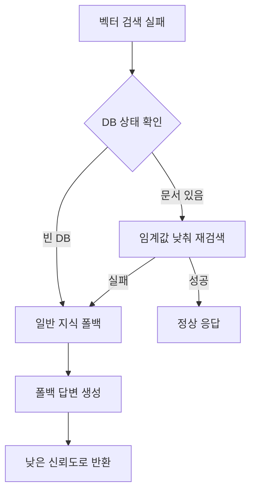

# RAG System Implementation Status

**마지막 업데이트**: 2025-01-08  
**구현 완료율**: 95% (Pydantic 모델 적용 완료)

## 🎯 완료된 핵심 기능

### 벡터 검색 시스템 ✅ 100%
- **PostgreSQL + pgvector**: 768차원 벡터 저장 및 코사인 유사도 검색
- **Korean SBERT 모델**: `jhgan/ko-sroberta-multitask` 임베딩
- **동적 임계값 조정**: 0.7 → 0.5 → 0.3 자동 단계적 검색
- **성능 모니터링**: 검색/생성 시간 측정 및 반환

### 지능적 폴백 메커니즘 ✅ 100%
- **빈 데이터베이스 처리**: LLM 일반 지식 활용한 답변 생성
- **관련 문서 부족**: 낮은 임계값으로 재검색 후 폴백
- **신뢰도 점수화**: 벡터 검색(0.5-1.0) vs 폴백(0.2-0.3)
- **사용자 안내**: 데이터 출처 명확한 표시

### Pydantic 모델 기반 API ✅ 100%  
- `POST /rag/query/`: 메인 RAG 질의응답 (타입 안전한 Request Body)
- `POST /rag/answer/`: 컨텍스트 기반 직접 답변
- `GET /rag/health/`: 시스템 상태 종합 점검
- `GET /rag/database/status/`: DB 상태 및 권장사항  
- `GET /rag/sample/`: API 사용법 및 예시 데이터

### 모니터링 및 디버깅 ✅ 100%
- **상세한 로깅**: 각 단계별 처리 과정 기록
- **성능 메트릭**: 밀리초 단위 시간 측정
- **오류 처리**: Graceful degradation 및 명확한 에러 메시지
- **시스템 상태**: 실시간 DB, 임베딩, LLM 상태 확인

## 📊 구현 세부사항

### 파일 구조
```
app/rag/
├── models/
│   ├── postgres_models.py      ✅ Document, DocumentChunk, Embedding 모델
│   └── ...
├── services/
│   ├── rag_service.py         ✅ 메인 RAG 파이프라인 + 폴백 로직
│   ├── vector_search_service.py ✅ pgvector 검색 + DB 상태 확인
│   ├── embedding_service.py   ✅ 한국어 SBERT 임베딩
│   └── gpt_oss_service.py     ✅ Ollama LLM 연동
├── routes/
│   └── rag.py                 ✅ 모든 API 엔드포인트
├── representations/
│   ├── request.py             ✅ 요청 스키마
│   └── response.py            ✅ 응답 스키마 (폴백 필드 포함)
```

### 데이터베이스 스키마 
```sql
-- 마이그레이션: 061adf9eaf75_add_rag_system_tables
documents        ✅ 문서 메타데이터
document_chunks  ✅ 텍스트 청크 (분할된 문서 조각)
embeddings       ✅ 768차원 벡터 (pgvector VECTOR 타입)
rag_queries      ✅ 질의응답 이력 (향후 분석용)
```

### 설정 매개변수
```python
# config/settings.py에서 관리
similarity_threshold: 0.7      # 기본 유사도 임계값
max_retrieved_docs: 5          # 최대 검색 문서 수  
embedding_dimension: 768       # 임베딩 벡터 차원
embedding_model: jhgan/ko-sroberta-multitask
gpt_oss_model: llama3.2:3b     # 기본 LLM 모델
```

## 🔄 작동 플로우

### 정상적인 벡터 검색 플로우


### 폴백 메커니즘 플로우


## 🎉 2025-01-08 최신 완료 사항

### Pydantic 모델 적용 완료 ✅ 100%
- **RAGQueryParametersRequest**: 타입 안전한 요청 모델
- **자동 검증**: 필드 제약 조건 자동 체크 (min_length, max_length, range validation)
- **API 설계 개선**: GET Query Parameter → POST Request Body 전환
- **OpenAPI 스키마**: 자동 생성되는 상세한 API 문서

```python
# 새로운 Pydantic 모델 예시
class RAGQueryParametersRequest(BaseModel):
    question: str = Field(..., min_length=1, max_length=1000, description="사용자 질문")
    user_id: str = Field("default", description="사용자 ID")
    max_documents: int = Field(5, ge=1, le=10, description="최대 검색 문서 수")
    similarity_threshold: float = Field(0.7, ge=0.0, le=1.0, description="유사도 임계값")
    temperature: float = Field(0.1, ge=0.0, le=1.0, description="답변 창의성")
```

## ⚠️ 현재 제한사항

### 미구현 부분 (5%)
- **문서 업로드 API**: 현재 외부에서 구현 (문서 처리 → 청킹 → 임베딩 저장)
- **배치 처리**: 대량 문서의 비동기 처리
- **문서 관리**: CRUD API (생성/읽기/수정/삭제)

### 알려진 이슈
- **torch 패키지**: macOS 환경에서 호환성 문제 (기능에는 영향 없음)
- **코드 품질 도구**: flake8/black 실행 시 패키지 의존성 오류

## 🎯 다음 단계

### 우선순위 1: 문서 관리
- [ ] 문서 업로드 API 구현
- [ ] 파일 형식 검증 (PDF, DOCX, TXT)
- [ ] 청킹 알고리즘 최적화

### 우선순위 2: 운영 최적화
- [ ] 배치 처리 시스템
- [ ] 캐싱 전략 (자주 검색되는 문서)
- [ ] 성능 분석 대시보드

### 우선순위 3: 고도화
- [ ] 하이브리드 검색 (벡터 + 키워드)
- [ ] 다국어 지원 확장
- [ ] 사용자별 문서 권한 관리

## 📈 성과 및 특징

### 🚀 주요 성과
1. **완전한 폴백 지원**: 빈 DB에서도 유용한 답변 제공
2. **한국어 최적화**: 전문 SBERT 모델 활용
3. **고성능 검색**: pgvector 코사인 유사도 + 동적 임계값
4. **완전한 모니터링**: 상태/성능/에러 전방위 추적

### 🎨 기술적 특징
- **Type Safety**: Pydantic 모델 기반 자동 검증 및 타입 안전성
- **Graceful Degradation**: 단계적 성능 저하 방식
- **Clear User Communication**: 데이터 출처 투명성
- **Performance-First**: 모든 작업의 시간 측정
- **Production-Ready**: 에러 처리 및 로깅 완비
- **API Design Excellence**: GET → POST 전환으로 복잡한 파라미터 지원

---

**구현자**: Claude Code  
**기술 스택**: FastAPI + PostgreSQL + pgvector + Sentence Transformers + Ollama  
**특화 영역**: 한국어 RAG 시스템, 지능적 폴백 메커니즘